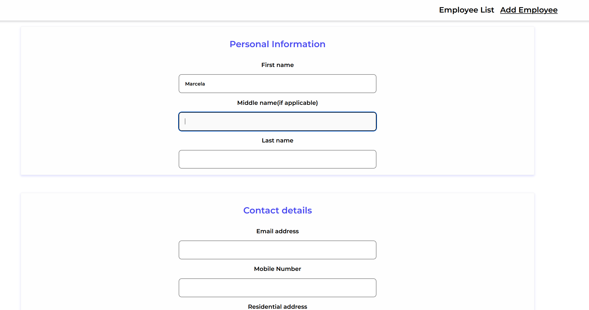
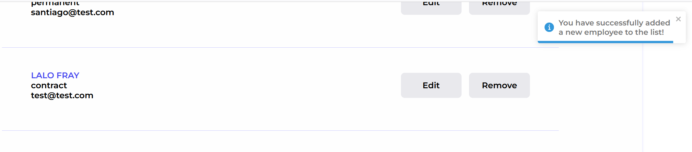
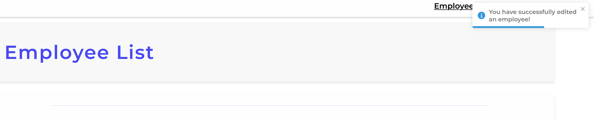

# Employee Creator 

## **Table of Contents** 

  - [**Table of Contents**](#table-of-contents)
  - [**Description**](#description)
  - [**My experience**](#my-experience)
  - [**Usage**](#usage)
  - [**Technologies Used**](#technologies-used)
  - [**Preview**](#preview)
  - [**Deployed link**](#deployed-link)
  - [**Future Development**](#future-development)
  - [**Questions**](#questions)


## **Description**

This project was designed to create a web application where employees can be added to a database, a list of employees is displayed as a home page, where you can modify and delete employees. 

To create employees a form need to be complete it, also if there is any information about an employee that needs to be change, the user can modify it by pressing the "modify" button or delete an employee from the database by pressing the "delete" button. 

This application consists of a spring RESTful API and a React Typescript frontend.

## **My experience**

I found this project a great opportunity to create a full-stack application, where I could for the first time develop a frontend with Typescript and a backend service with Spring.

Writing code with TS was challenging as since I started coding I used JS and I feel very confortable with it, however it was good to get out of the confort zone and bring a new skill to the table. 


## **Usage**
To start the frontend using the terminal inside the client folder:

```
npm run dev 
```

To initialise the backend:
```
Using Eclipse, IntelliJ or a bash terminal/console, run/execute the Main class. 
```


## **Technologies Used**

* Java
* Spring
* React
* Typescript
* SCSS
* HTML
* Spring boot unit test

## **Preview**

* **Employee List**


* **Create an employee**



* **Toastify notification when when adding an employee**



* **Toastify notification when when updating an employee**




## **Deployed link**

To send live this application [Ruben](https://github.com/arg2009) help me out with the deployment on his server.

💡 Live version: [click here!](https://employee-creator.rubencito.net/)

## **Future Development**

* Implement authentication.
  * Create login page.
  * Implement spring basic authentication (security). 
* Implement an API logging strategy.
* Testing the frontend.
* Implement Axios over Fetch.

## **Questions**

* Contact me on my GitHub profile: [Marcela's GitHub](https://github.com/marcelamejiao)
